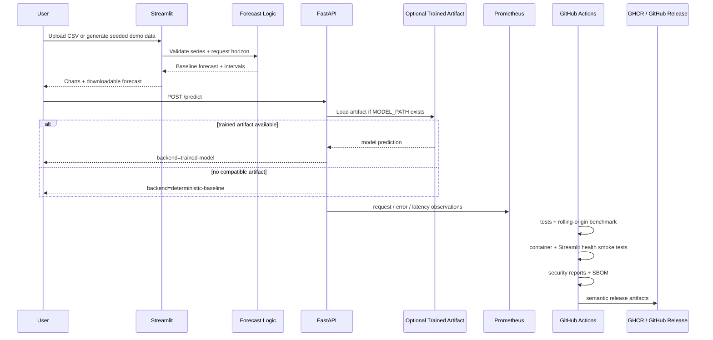

# ⚡ Energy Demand Forecasting — DevMLOps


Production-oriented time-series forecasting, observable inference, reproducible research evidence, and deployment automation.

[](https://github.com/CoreyLeath-code/Energy-Demand-Forecasting-DevMLOps/actions/workflows/ci.yml)
[](https://github.com/CoreyLeath-code/Energy-Demand-Forecasting-DevMLOps/actions/workflows/benchmarks.yml)
[](https://github.com/CoreyLeath-code/Energy-Demand-Forecasting-DevMLOps/actions/workflows/security.yml)
[](https://github.com/CoreyLeath-code/Energy-Demand-Forecasting-DevMLOps/actions/workflows/codeql.yml)
[](LICENSE)


> **Evidence boundary:** the committed benchmark measures the transparent seasonal-naive baseline on seeded synthetic hourly demand. It does **not** establish real-grid generalization, trained deep-model accuracy, calibrated production uncertainty, or a utility-grade service-level objective.

## What this repository demonstrates

`Energy-Demand-Forecasting-DevMLOps` is a portfolio-scale forecasting and MLOps system with two intentionally distinct paths:

1. a **public, artifact-independent path** built around reproducible synthetic data and a transparent seasonal-naive forecast; and
2. a **trained-model path** for LSTM, GRU, Transformer, and other model experiments whose artifacts can be tracked and served without being confused with the public baseline.

The engineering surface includes validated time-series preparation, research-style evaluation, FastAPI inference, Prometheus metrics, Streamlit analytics, MLflow foundations, Docker, Kubernetes/Helm, infrastructure automation, CI, security evidence, SBOM generation, and semantic releases.

The repository is production-shaped, not production-certified. See [`L6_AUDIT.md`](L6_AUDIT.md) for the current promotion assessment and [`docs/AUDIT.md`](docs/AUDIT.md) for the reproducibility controls.

---

## Evidence snapshot

The current committed evidence is generated by a seeded, leakage-aware rolling-origin benchmark and CI test suite.

| Evidence | Current recorded result | Source |
|---|---:|---|
| Test suite | 23 passing tests | CI / `docs/AUDIT.md` |
| Measured coverage | 93.10% | CI / `docs/AUDIT.md` |
| Rolling-origin protocol | 30 folds / 720 predictions | `benchmarks/latest.json` |
| MAE | 88.674 demand units | `benchmarks/latest.json` |
| RMSE | 104.780 demand units | `benchmarks/latest.json` |
| MAPE / sMAPE | 6.994% / 7.001% | `benchmarks/latest.json` |
| MASE | 1.551 | `benchmarks/latest.json` |
| Mean signed error | +0.553 demand units | `benchmarks/latest.json` |
| Fold MAE mean ± SD | 88.674 ± 50.136 | `benchmarks/latest.json` |
| Benchmark latency mean / P95 / P99 | 28.422 / 28.969 / 40.401 ms | `benchmarks/latest.json` |
| Benchmark throughput | 35.18 24-hour forecasts/s | `benchmarks/latest.json` |
| Peak traced Python allocation | 0.530 MiB | `benchmarks/latest.json` |

**Recorded protocol:** seed `20260719`; 2,160 synthetic hourly observations; SHA-256 `d77dd9c630e8576cffcd2b00420294a5632761eec86842f4f68fd265e78fd102`; 14-day initial history; 30 non-overlapping 24-hour folds; 50 warmups; 500 timed iterations; GitHub-hosted Ubuntu 24.04 / Python 3.11.15.

Runtime measurements are environment-sensitive. Quality metrics and the dataset fingerprint are the reproducibility anchors.

---

## Architecture flowchart

```mermaid
flowchart LR
    A[CSV upload or seeded synthetic demand] --> B[Schema + time-series validation]
    B --> C[Feature / history preparation]

    C --> D[Seasonal-naive public baseline]
    D --> E[Streamlit dashboard]

    C --> F[Training pathway]
    F --> G[LSTM / GRU / Transformer / estimator artifacts]
    G --> H[Artifact + metadata storage]
    H --> I[FastAPI inference]

    I --> J[/health]
    I --> K[/metrics]
    I --> L[/predict]

    E --> M[Research evidence]
    I --> M
    M --> N[GitHub Actions]
    N --> O[Tests + benchmark artifacts]
    N --> P[Docker / Helm validation]
    N --> Q[Security + SBOM evidence]
    N --> R[GitHub Release + GHCR]
```

## System design flow



---

## Quick Start

### Option A — FastAPI service

Linux/macOS:

```bash
git clone https://github.com/CoreyLeath-code/Energy-Demand-Forecasting-DevMLOps.git
cd Energy-Demand-Forecasting-DevMLOps
python -m venv .venv
source .venv/bin/activate
python -m pip install --upgrade pip
pip install -r requirements-api.txt
uvicorn src.serve.app:app --host 0.0.0.0 --port 8000
```

Windows PowerShell:

```powershell
git clone https://github.com/CoreyLeath-code/Energy-Demand-Forecasting-DevMLOps.git
cd Energy-Demand-Forecasting-DevMLOps
py -3.11 -m venv .venv
.\.venv\Scripts\Activate.ps1
python -m pip install --upgrade pip
pip install -r requirements-api.txt
uvicorn src.serve.app:app --host 0.0.0.0 --port 8000
```

Verify:

```bash
curl http://127.0.0.1:8000/health
```

OpenAPI docs: `http://127.0.0.1:8000/docs`

### Option B — Streamlit dashboard

```bash
python -m venv .venv
source .venv/bin/activate
python -m pip install --upgrade pip
pip install -r streamlit_demo/requirements.txt
streamlit run streamlit_demo/app.py
```

Windows activation equivalent:

```powershell
.\.venv\Scripts\Activate.ps1
```

Dashboard: `http://127.0.0.1:8501`

### Option C — Containerized API

```bash
docker build -t energy-demand-forecasting:local .
docker run --rm -p 8000:8000 energy-demand-forecasting:local
curl http://127.0.0.1:8000/health
```

The runtime image uses a multi-stage build, a non-root UID (`10001`), an explicit Uvicorn entry point, and a health check.

### Option D — Full training / MLOps environment

```bash
python -m venv .venv
source .venv/bin/activate
python -m pip install --upgrade pip
pip install -r requirements.txt
```

Use this environment for the broader training, MLflow, and experiment-management surface rather than the lightweight public demo.

---

## Reproduce the benchmark evidence

```bash
python -m venv .venv
source .venv/bin/activate
pip install -r requirements-dev.txt
PYTHONHASHSEED=0 python benchmarks/run_benchmark.py \
  --iterations 500 \
  --warmup 50 \
  --output benchmark-results.json
```

PowerShell:

```powershell
$env:PYTHONHASHSEED="0"
python benchmarks/run_benchmark.py --iterations 500 --warmup 50 --output benchmark-results.json
```

Validate the focused evidence suite:

```bash
pytest tests/test_api.py tests/test_forecasting.py tests/test_evaluation.py -v
```

The benchmark workflow additionally verifies the fold/sample contract, a 64-character dataset fingerprint, a positive P95 latency value, and `MASE < 2.0` before retaining the JSON artifact.

### Interpretation

The benchmark answers: **“Is this public baseline deterministic, leakage-aware, measurable, and reproducible on the recorded synthetic protocol?”**

It does not answer: **“Will this system forecast a real power grid accurately under operational distribution shift?”**

That second question requires real, versioned data; explicit train/validation/test time boundaries; trained-model comparisons; probabilistic calibration; drift analysis; and domain review.

---

## FastAPI contract

| Method | Endpoint | Purpose |
|---|---|---|
| `GET` | `/` | service identity/version |
| `GET` | `/health` | liveness + model artifact availability |
| `GET` | `/metrics` | Prometheus exposition |
| `POST` | `/predict` | validated prediction with backend provenance |

Example:

```bash
curl -X POST http://127.0.0.1:8000/predict \
  -H "Content-Type: application/json" \
  -d '{"load_ma_3h":1234.5,"temperature_ma_3h":22.1}'
```

Without a mounted model artifact, the API identifies the result as:

```json
{
  "predicted_load": 1239.75,
  "backend": "deterministic-baseline",
  "model_version": "1.1.0"
}
```

A compatible model loaded through `MODEL_PATH` is reported as `backend=trained-model`. This provenance is deliberate: fallback output is never presented as trained-model inference.

Request fields are bounded by Pydantic contracts, and backend failures return a controlled `503` rather than exposing internal exceptions.

---

## MLOps and deployment surface

The repository contains evidence and scaffolding for:

- MLflow experiment tracking and deployment configuration;
- Dockerized service execution;
- Kubernetes and Helm deployment manifests;
- Compose validation;
- Terraform / Ansible infrastructure foundations;
- Prometheus metrics and Grafana-oriented monitoring assets;
- GitHub Actions CI and benchmark evidence;
- Dependabot dependency maintenance;
- CodeQL and secret scanning;
- Trivy filesystem/container reports;
- `pip-audit` dependency reports;
- CycloneDX SBOM generation;
- semantic tag-driven GitHub Releases and GHCR publication.

**Important security distinction:** the current Trivy and `pip-audit` jobs retain findings for review rather than failing the workflow on every HIGH/CRITICAL or dependency advisory. They are evidence-producing controls, not a complete blocking vulnerability policy.

---

## CI and evidence contract

The main CI workflow validates:

- Python 3.10 and 3.11;
- syntax compilation;
- Ruff high-confidence correctness checks;
- focused API/forecast/evaluation tests;
- coverage threshold ≥ 90%;
- JUnit + coverage artifacts;
- Streamlit import + live health smoke test;
- Docker build + live `/health` smoke test;
- Compose configuration;
- strict Helm lint + rendered manifests;
- a release-readiness metadata contract.

The research workflow reruns the seeded rolling-origin benchmark on `main`, `development`, and pull requests to `main`.

---

## Evidence and reproducibility matrix

| Claim | Evidence | Reproduce / inspect | Boundary |
|---|---|---|---|
| API input validation | `src/serve/app.py`, API tests | `pytest tests/test_api.py -v` | does not prove load resilience |
| Forecast determinism | forecasting/evaluation tests | focused pytest suite | synthetic/public baseline only |
| Test coverage | CI XML + terminal report | CI / local pytest coverage | selected modules, not entire repo |
| Rolling-origin quality | `benchmarks/latest.json` | `benchmarks/run_benchmark.py` | synthetic baseline only |
| Runtime benchmark | benchmark JSON | same benchmark command | excludes network/UI/container overhead |
| Container health | CI container smoke test | build/run + `/health` | smoke test, not soak test |
| Streamlit deployability | live CI health probe | `streamlit run ...` | startup health, not UX/load SLO |
| Helm renderability | CI lint/template | `helm lint`, `helm template` | not a live-cluster deployment test |
| Security evidence | CodeQL/Gitleaks/Trivy/pip-audit/SBOM | security workflows | some vulnerability jobs are advisory |
| Release traceability | semantic tag workflow | `.github/workflows/release.yml` | release success is not production approval |

---

## Extended Q&A

**Why keep a deterministic fallback instead of failing when a model is absent?**  
It keeps demos, CI, health checks, and integration development usable without pretending a trained model exists. The API always returns the backend provenance.

**Are the LSTM, GRU, and Transformer models represented by the benchmark table?**  
No. The committed benchmark is explicitly for the seasonal-naive public baseline. Trained architectures need their own versioned datasets, split metadata, artifacts, and evaluation records.

**Why is rolling-origin evaluation important?**  
Time-series models must not train on information from the future. Expanding-window folds preserve chronology and make the evaluation protocol auditable.

**Is MASE 1.551 “good”?**  
It is a recorded result, not a marketing claim. Interpretation depends on the scaling baseline and target use case. This repository deliberately publishes the value rather than hiding an inconvenient metric.

**Does a green security workflow mean zero vulnerabilities?**  
No. CodeQL and Gitleaks execute as checks, while current Trivy and `pip-audit` jobs are configured to retain reports for triage. Review the artifacts and remediation policy separately.

**Is the repository production-ready?**  
It demonstrates many production-oriented controls, but real-grid validation, trained-model evaluation, load/soak testing, failure injection, rollback drills, and stricter vulnerability policy are still promotion work.

**What would make the ML story materially stronger?**  
A versioned real-world or public energy dataset, a leakage-safe comparative study across seasonal-naive/XGBoost/LSTM/GRU/Transformer candidates, confidence intervals across temporal regimes, calibration/coverage evidence, and a model card tied to exact artifacts.

---

## Engineering roadmap

### Phase 1 — Evidence discipline

- keep all README metrics tied to committed JSON or CI artifacts;
- record commit SHA and environment in benchmark evidence;
- add explicit benchmark schema validation/versioning;
- retain trained-model metadata with dataset/config/model hashes.

### Phase 2 — Forecasting research depth

- add a versioned public real-world energy dataset;
- compare baseline, tree-based, recurrent, and Transformer models under identical rolling-origin splits;
- add prediction-interval coverage and calibration metrics;
- report regime-specific error for peaks, weekends, seasonal changes, and extreme temperatures.

### Phase 3 — Serving reliability

- add concurrent API load tests with P50/P95/P99 latency and throughput;
- add container resource-limit tests;
- test model reload and corrupt-artifact failure modes;
- add readiness semantics separate from basic liveness if trained-model availability becomes mandatory.

### Phase 4 — Security and supply-chain promotion

- define remediation SLAs by severity;
- convert selected Trivy and dependency findings from report-only to blocking policy once the baseline is clean;
- retain release SBOM/provenance with immutable image digests;
- automate artifact signature verification in deployment validation.

### Phase 5 — Deployment and governance

- run Helm manifests against an ephemeral Kubernetes environment;
- validate Terraform and Ansible paths in CI where practical;
- add rollback/failure-injection evidence;
- define model promotion, deprecation, drift response, and operational ownership criteria.

---

## Repository map

```text
.github/workflows/       CI, benchmarks, security, release automation
benchmarks/              seeded research benchmark + committed evidence
config/                  forecasting / training configuration
docs/                    audits, deployment and engineering guidance
helm/                    Kubernetes packaging
k8s/                     Kubernetes deployment assets
mlflow/                  experiment-tracking deployment assets
src/                     forecasting, evaluation, model and serving code
streamlit_demo/          lightweight public dashboard
tests/                   API / forecasting / evaluation tests
Dockerfile               multi-stage non-root API image
requirements-api.txt     slim API dependency surface
requirements-dev.txt     CI / benchmark dependencies
requirements.txt         broader training / MLOps environment
```

---

## Scope and limitations

This project is an engineering and research portfolio system. It is **not** a utility control system, dispatch engine, market-bidding engine, or evidence of commercial forecasting accuracy.

Do not infer production readiness from architecture breadth alone. Promotion should be based on versioned model evidence, real deployment tests, vulnerability policy, observability, failure recovery, and domain-specific acceptance criteria.

## License

MIT — see [`LICENSE`](LICENSE).
